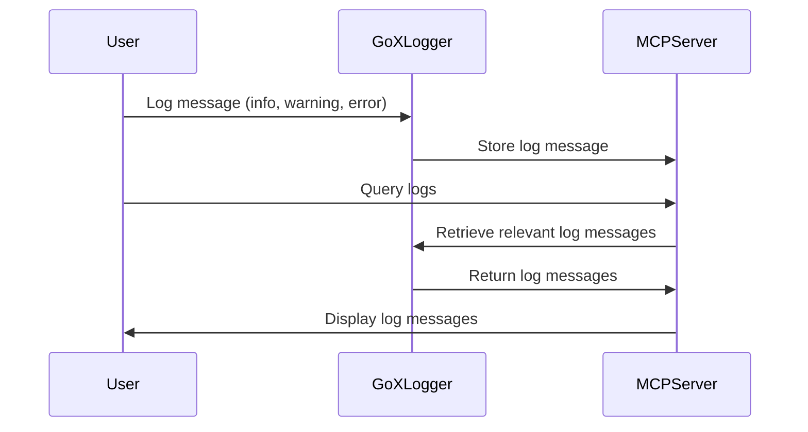

# Go X-Logger

Go X-Logger is a lightweight and flexible logging library made with Go which allows you to parse large log files and extract meaningful information from them. It supports various log formats and provides an easy-to-use API for logging messages at different levels (info, warning, error, etc.).

It comes with an integrated MCP server based on mcp-golang which allows any AI agent to interrogate the logs.

## Architecture

